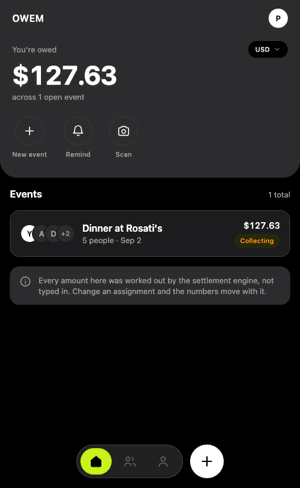
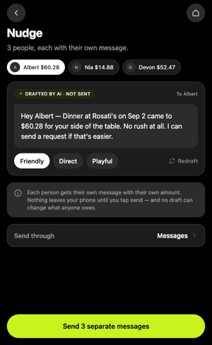
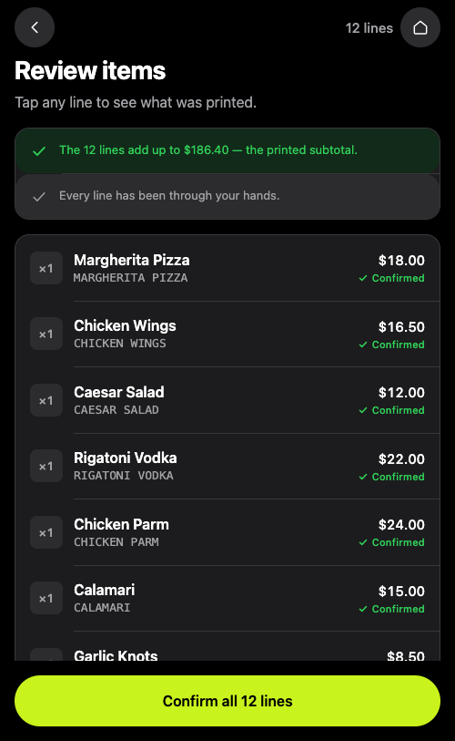
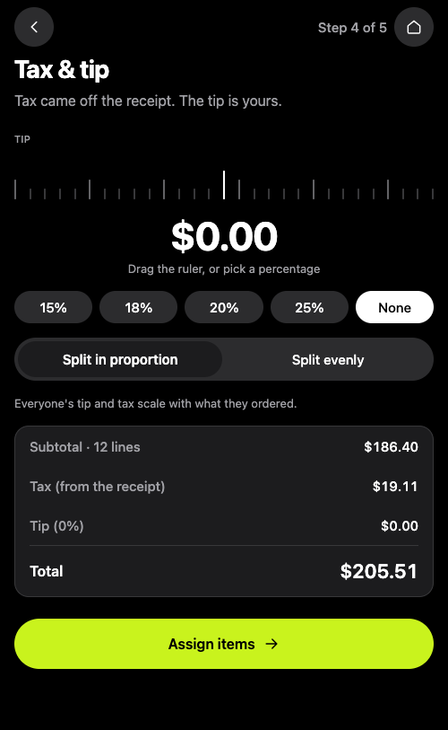
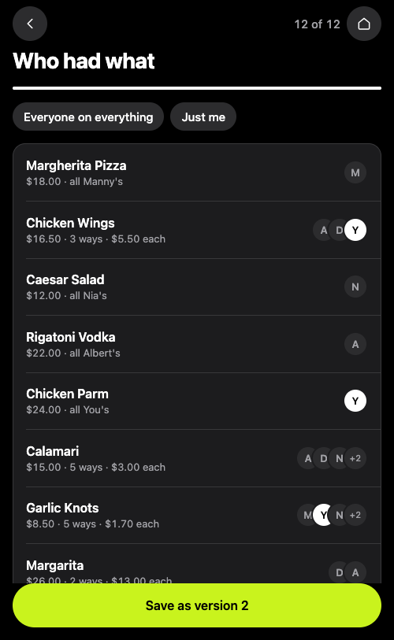
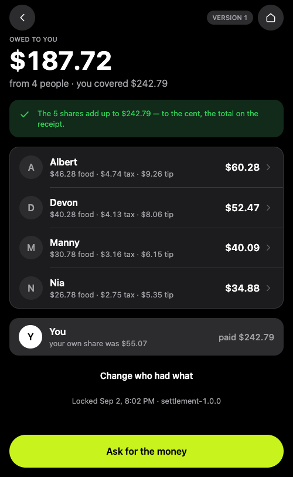
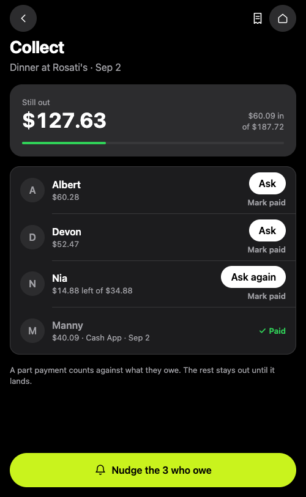
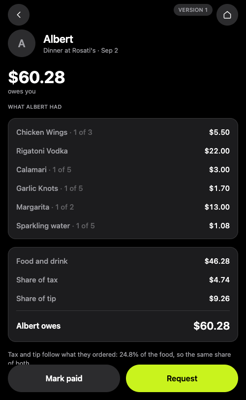
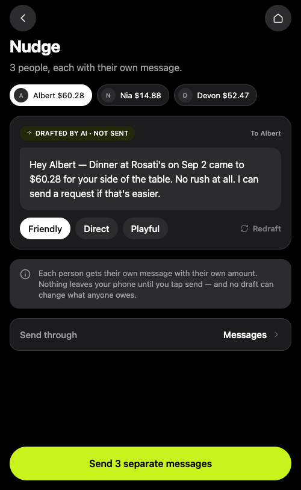

<div align="center">

# OWEM

### One person pays. Everyone squares up.

Photograph the receipt, tap who had what, and every share of the tax and tip works out to the cent.

**[www.owem.app](https://www.owem.app/)**

  

</div>

---

## The problem

Six friends have dinner. One card pays. Now five people owe that person money and nobody knows exactly how much, because the bill has eighteen lines, tax, and a tip, and three people shared the calamari.

What actually happens is someone opens the calculator, gives up after four minutes, and says *"let's just split it evenly"* — and whoever ordered a salad quietly subsidises whoever ordered a steak.

Interviews with people who habitually pay for group dinners put numbers on it:

| | |
|---|---|
| Time from receipt to amounts posted | ~10 minutes |
| Manual calculations performed | ~12 |
| Calculation error rate | ~10% of events |
| **Events that ended in "just split it evenly"** | **1 in 3** |

That last row is the product thesis. People were knowingly accepting an unfair financial outcome to avoid a workflow cost. Removing that cost *is* the product.

## The one idea everything follows from

> **AI interprets uncertain information. Deterministic code performs every financial calculation. A language model may never compute, modify, or approve a balance.**

Reading `CHKN PARM` off a crumpled thermal receipt is genuinely ambiguous — that is a real AI problem. Adding up six numbers is not. Wrapping a model around arithmetic would be slower, costlier, non-reproducible, and wrong some fraction of the time.

So the boundary is enforced in four places, by code and by tests:

- every AI-produced value is tagged `AI_SUGGESTED` in the database
- the settlement engine **raises** if it sees one — it cannot be configured not to
- `money.py` and `settlement.py` import no framework, no ORM and no AI SDK; a test fails the build otherwise
- the AI SDK is imported in exactly one file, and a test asserts that too

## The flow

<table>
<tr>
<td width="25%"></td>
<td width="25%"></td>
<td width="25%"></td>
<td width="25%"></td>
</tr>
<tr>
<td align="center"><b>Home</b><br><sub>Every amount came from the engine</sub></td>
<td align="center"><b>Review</b><br><sub>Nothing proceeds until a human confirms</sub></td>
<td align="center"><b>Tax &amp; tip</b><br><sub>Proportional or even, as a named policy</sub></td>
<td align="center"><b>Assign</b><br><sub>Shared items split automatically</sub></td>
</tr>
<tr>
<td></td>
<td></td>
<td></td>
<td></td>
</tr>
<tr>
<td align="center"><b>Settlement</b><br><sub>The shares add up to the cent</sub></td>
<td align="center"><b>Collect</b><br><sub>Part payments count against what's owed</sub></td>
<td align="center"><b>One share</b><br><sub>Every line that made the number</sub></td>
<td align="center"><b>Nudge</b><br><sub>Each person's own message, editable</sub></td>
</tr>
</table>

## How it is built

```
Phone (Expo / React Native)
   │  JSON over HTTPS, money always as strings
   ▼
FastAPI  ── api.py ─── routes: parse, authorize, delegate, return
   │
   ├──▶ ai.py ──────▶ Claude (vision)   returns AI_SUGGESTED values
   │
   ├──▶ settlement.py ──▶ money.py      the only place money is calculated
   │
   ├──▶ db.py / tables.py ──▶ PostgreSQL
   └──▶ storage.py ──▶ receipt images
```

Eleven backend files, 1,885 lines, each with a job you can say in a sentence.

| File | Lines | Job |
|---|---:|---|
| `api.py` | 449 | The FastAPI app and every route |
| `db.py` | 365 | The functions that read and write the database |
| `ai.py` | 279 | The Claude call, the stub, and validation of what comes back |
| `models.py` | 218 | Every shape, once — database row to HTTP response |
| `tables.py` | 199 | The SQLAlchemy table definitions |
| `settlement.py` | 112 | The engine and its two guards |
| `prompt.py` | 93 | The prompt text and the output schema |
| `money.py` | 55 | Cents, allocate, assert_sums_to |
| `storage.py` | 53 | Receipt photos |
| `config.py` | 37 | Settings from environment variables |
| `errors.py` | 25 | One error type |

## Money

`0.1 + 0.2 == 0.30000000000000004`. That is not a Python bug, it is binary floating point, and a settlement that is a cent off is wrong. So money is never a float — the defence is layered, because Python will let one in through any door left open:

| Layer | Defence |
|---|---|
| The wire | Money crosses the API as a **string** — `"16.50"`, never `16.50` |
| The parser | The `Money` type **raises on a float**: *send money as a string, like "16.50"* |
| The database | `Numeric(12, 2, asdecimal=True)`. Never `Float`, never `REAL` |
| The engine | Converted once to `int` cents at the boundary; integer arithmetic only inside |
| Rounding | `round()` is never called on money — rounding is a domain decision with a named rule |

`allocate()` is 22 lines and is the heart of the whole thing. It splits cents by **largest remainder**: everyone gets the floor of their exact share, then the leftover cents go one each to whoever was cut most, ties breaking to the larger weight and then the earlier index. Multiplication happens before division so no precision is lost, and the function asserts the parts sum to the total before returning — in production, not just in tests.

## Running it

```bash
docker compose up -d db                     # Postgres
cd backend && .venv/bin/uvicorn owem.api:app --reload
cd frontend && npm start                    # scan the QR with Expo Go
```

Full instructions, including the LAN-address trap that makes a phone silently fall back to sample data, are in **[RUNNING.md](RUNNING.md)**. With no API key configured the receipt reader uses a built-in stub, so the whole app runs end to end with no credentials, no cost and no network.

## Tests and evals

```bash
cd backend  && .venv/bin/python -m pytest    # 167 tests
cd frontend && npm test && npx tsc --noEmit
```

The valuable tests are not the CRUD ones. They are the invariants: parts always sum to the total, an `AI_SUGGESTED` value cannot reach the engine, an unassigned item blocks settlement, settlements are never edited, and one person's overpayment can never cancel another's debt.

You cannot unit test "did the model read this receipt correctly" — so `evals/` holds receipt images with hand-written ground truth, a scorer and a report. The headline accuracy number is the least interesting thing it measures; what matters is **calibration**. A model that is 90% accurate and knows which 10% it got wrong is a good product. One that is 97% accurate and confidently wrong about the rest is dangerous, because those errors go straight past the human and into somebody's bill.

## Where the detail lives

| | |
|---|---|
| Running it locally | [RUNNING.md](RUNNING.md) |
| Why things are the way they are | [docs/architecture/decisions/](docs/architecture/decisions/) |
| Schema and tables | [docs/architecture/data-model.md](docs/architecture/data-model.md) |
| Endpoints and errors | [docs/architecture/api-design.md](docs/architecture/api-design.md) |
| AI contracts | [docs/architecture/ai-design.md](docs/architecture/ai-design.md) |
| Security controls | [docs/architecture/security.md](docs/architecture/security.md) |
| Design system and colour | [docs/design-system.md](docs/design-system.md) |
| The engineering rules this repo is held to | [CLAUDE.md](CLAUDE.md) |

## Status

Feature-complete for local development; both platforms build. **Not yet shippable to the public**, and the reason is written down rather than hidden:

- **No authentication.** Every request resolves to one development user via `db.current_user`. This was a build-order decision — [ADR-0002](docs/architecture/decisions/0002-build-order.md) put the deterministic engine first, because exactness is the thing you cannot add later. Auth is additive and lands on one function.
- **Receipt photos are on local disk.** Fine locally, wrong in production, where container filesystems are ephemeral. `storage.py` is the only file that touches the filesystem.
- **The AI call is synchronous**, holding a request open for seconds. It becomes a job plus polling when concurrency justifies the complexity.

OWEM never moves money. It composes a pre-filled request and hands off to Venmo, Cash App or Zelle — [ADR-0005](docs/architecture/decisions/0005-payment-flow.md) explains why that decision was reversed from the original plan, and what holding other people's money would have cost.
